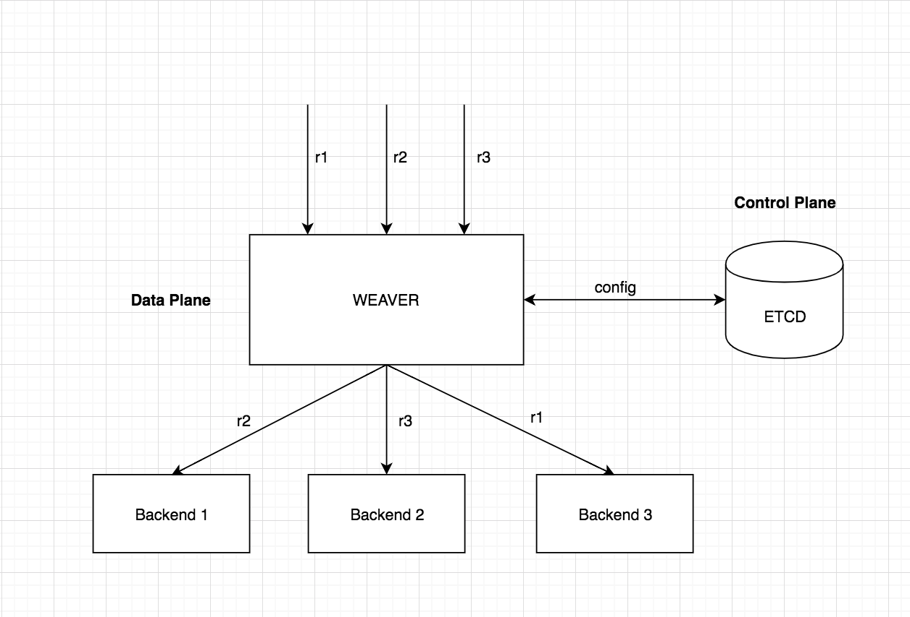

# Weaver - A modern HTTP Proxy with Advanced features

<a href="https://travis-ci.org/gojektech/weaver"></img></a> [](https://goreportcard.com/report/github.com/gojekfarm/weaver)
  <a href="https://golangci.com"></img></a>
[](https://coveralls.io/github/gojektech/weaver?branch=master)

* [Description](#description)
* [Features](#features)
* [Installation](#installation)
* [Architecture](#architecture)
* [Configuration](#configuration)
* [Contributing](#contributing)
* [License](#license)

## Description
Weaver is a Layer-7 Load Balancer with Dynamic Sharding Strategies. 
It is a modern HTTP reverse proxy with advanced features.

## Features:

- Sharding request based on headers/path/body fields
- Emits Metrics on requests per route per backend
- Dynamic configuring of different routes (No restarts!)
- Is Fast
- Supports multiple algorithms for sharding requests (consistent hashing, modulo, s2 etc)
- Packaged as a single self contained binary
- Logs on failures (Observability)

## Installation

### Build from source

- Clone the repo:
```
git clone git@github.com:gojektech/weaver.git
```

- Build to create weaver binary
```
make build
```

### Binaries for various architectures

Download the binary for a release from: [here](https://github.com/gojekfarm/weaver/releases)

## Architecture

<p align="center"></p>

Weaver uses `etcd` as a control plane to match the incoming requests against a particular route config and shard the traffic to different backends based on some sharding strategy.

Weaver can be configured for different routes matching different paths with various sharding strategies through a simple route config named ACL.

The various sharding strategies supported by weaver are:

- Consistent hashing (hashring)
- Simple lookup based
- Modulo
- Prefix lookup
- S2 based

## Examples

We have examples defined to deploy it to kubernetes and using acls. Please checkout out examples directory

## Configuration

### Defining ACL's

Details on configuring weaver can be found [here](docs/weaver_acls.md)

## Contributing
If you'd like to contribute to the project, refer to the [contributing documentation](https://github.com/gojektech/weaver/blob/master/CONTRIBUTING.md)

## License

```
Copyright 2018, GO-JEK Tech (http://gojek.tech)

Licensed under the Apache License, Version 2.0 (the "License");
you may not use this file except in compliance with the License.
You may obtain a copy of the License at

    http://www.apache.org/licenses/LICENSE-2.0

Unless required by applicable law or agreed to in writing, software
distributed under the License is distributed on an "AS IS" BASIS,
WITHOUT WARRANTIES OR CONDITIONS OF ANY KIND, either express or implied.
See the License for the specific language governing permissions and
limitations under the License.
```
